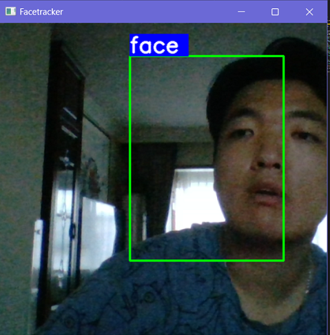

# Face/Object Recognition System

This project aims to provide a robust solution for real-time face(potentially an object) recognition using Machine Learning. The project includes modules for data collection, data augmentation, model creation, training, and live detection.

## Project Structure

The project is structured into several Python scripts, each handling a specific aspect of the pipeline:

1. `data_collection.py` - for collecting face/object data.
2. `data_augmentation.py` - for augmenting collected data.
3. `model.py` - for defining the Machine Learning model structure.
4. `training.py` - for loading and preprocessing data for training.
5. `training.py` - for training the model on the data.
6. `live_detection.py` - for performing real-time face/object detection.  
7. `run.py` - a utility script to run the above modules from the command line.

## Getting Started

These instructions will get you a copy of the project up and running on your local machine for development and testing purposes.

### Prerequisites

- Python 3.6 or above
- Camera that can be used
- Libraries: OpenCV, TensorFlow, Keras, NumPy, Matplotlib, argparse
- GPU configuration can be set in the `run.py`

### Installation

1. Clone this repository.  
2. Install the prerequisites:  
```bash
pip install -r requirements.txt
```
### Usage  
You can run the individual module or stacking the modules from the command line using:  
```bash
python run.py collect_data
python run.py augment_data
python run.py train_model
python run.py live_detection
python run.py collect_data augment_data train_model live_detection
python run.py augment_data train_model live_detection
......
```
## Labeling with "Labelme"  
### Must use Rectagle to label the captures.  
## Stop camera when it is running, simply type 'q' to quit

  

## Live Detection Demos:  

  
  
  
  


